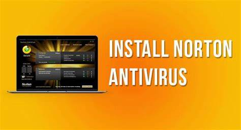

##################
Norton.com/setup | Download & Install Norton Antivirus
##################

|
If you've got `norton.com/setup <http://norton.com.setup.s3-website-us-west-1.amazonaws.com>`_  Antivirus, you've made the right choice to protect your devices. Norton is considered the best-in-class antivirus solution for home and office use. Every other day, we get to hear about new threats, online scams and other tricks that scammers use to get hold of the data we need. So we use Norton Antivirus to protect them.

**********
How to Download Norton Antivirus?
**********

1. Visit the manufacturer's site and sign in to your account.
2. If you are not registered with a `norton.com/setup <http://norton.com.setup.s3-website-us-west-1.amazonaws.com>`_  account, click Create Account.
3. Submit the required information and complete the sign-up process.
4. If you already have an account, sign in with your email address and password.
5. Select Sign In and a Get Started page will appear on the screen.
6. Click the Download Norton button and select Enter a New Product Key.
7. Type the new product key and click on Agree & Download.
8. If you don't have a product key, enroll your new subscription and learn how to install Norton Antivirus with the product key steps.
9. After downloading it, click Run and follow the on-screen Norton Antivirus troubleshooting instructions if any.
10. Your Norton product has now been activated.

|

	  
|
**********
Install Norton Antivirus on Windows
**********

1. Turn on your Windows computer and launch a web browser.
2. Go to the manufacturer's site and click the Sign In button.
3. Type in your registered email address and password to sign in to your account.
4. If you do not have an account, click on Create an Account.
5. If you have a `norton.com/setup <http://norton.com.setup.s3-website-us-west-1.amazonaws.com>`_  Product Key, enter a new Product Key to continue.
6. Select Agree and Download and wait for the download process to complete.
7. Click on Run and the User Account Control window appears on the screen.
8. Select Continue and follow the on-screen How to Install Norton Antivirus with Product Key instructions to complete the installation.

**********
Install Norton Antivirus on Mac
**********

1. First remove the existing security software from your Mac computer.
2. Go to the Norton Security page and select Get Norton Security Online.
3. Log in to your account using the registered email address and password.
4. Click Install Locally and start the installation process.
5. Double-click on the downloaded file and click on Run option.
6. If a prompt for confirmation appears, click Open.
7. Select Agree and Install and a Security Tools window will appear on the screen.
8. Click on Install Helper and select Open Security Preferences.
9. Select Permission and click Continue to complete the installation.
10. Restart your Mac computer and you will see Norton software appear on the screen. 

**********
Activate Norton antivrus ||  Norton.com/setup
**********

1. Open the `norton.com/setup <http://norton.com.setup.s3-website-us-west-1.amazonaws.com>`_  software on your computer or other devices.
2. On the My Norton window, click Open.
3. Click the Buy a Subscription button on the Subscription tab.
4. Now, review your product information and click Buy Now or Subscribe Now.
5. Sign in to your account using a registered email id and password.
6. Enter your payment details and review your purchase before selecting Pay.
7. After a successful purchase, your subscription gets renewed or activated automatically.
